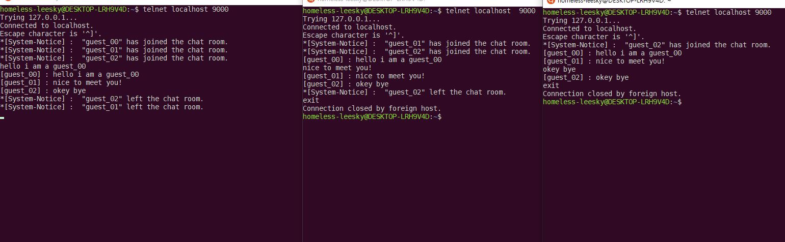

# Tcp-Socket-Server Project

1. I worked in a **WSL(Windows Subsystem for Linux) Ubuntu 18.04 environment**. and I edited with **Visual Studio code Editor**. 
2. **It was a my university class**, then i wanna remember how to make socket server with c-lang 
3. but it is a reallllllly simple socket server, so I think, It is working in only local network -> ***maybe will wrong thing***  
 

**Before proceeding**, we need some conditions on the command line.

- telnet
- gcc

`$ apt install telnet `  
`$ apt install gcc `

## 1. tcp_echo_server.c
***On the server side,***
 - **First**, compile the file into an object file. 
`$ gcc -o tcp_echo_server tcp_echo_server.c`

 - **Second**, Run the executable file. 
`$ ./tcp_echo_server`
 

***On the client side,***
 - **First**, Try to connect via telnet. In this source, port is 9000
 - If you wanna connect locally, the IP address is **localhost**  
`$ telnet IPaddr PORT`

 - **Second**, Enter any word  
 - The server reprints the words entered by the client. 
`$ anyword`

***If you  fail to connect, suspect the following :***
 - source
 - firewall
 - Socket Status   
 `netstat -ant | grep PORT`
 - faith

**So, if we can output words entered by one client to another client, we can implement a chat server**.  
 - However, This source is structurally impossible to multiprocess.
 - To create a chat server, multiple clients need to connect at the same time.
 - In other words, multiprocessing should be possible.
 - Multiprocessing with `fork()` and Multithreading with **pthread** make this possible.
 
 **So, this project will build a chat server after implementing multiprocessing and multithreading** 
 (Yes! That's the ultimate goal of this project)
 
## 2. tcp_echo_fork_server.c

***On the server side,***
 - **First**, compile the file into an object file. 
`$ gcc -o tcp_echo_fork_server tcp_echo_fork_server.c`

 - **Second**, Run the executable file. 
`$ ./tcp_echo_fork_server`
 

***On the client side,***
 - you can do as you did in the tcp_echo_server.c file.
 

### what is `fork()` ?
- ***In short, the fork () function duplicates the current process.*** (Register, stack, code, data, heap, resources, etc.)
- `fork()` return value is **zero** for the child process and **pid value of the child process** for the parent process. 
- In other words, **we define the behavior of the parent and child separately**, depending on the return value of fork.
- So the **parent process accepts the connection**, clones the process, and then the **child process handles the logic.**
- Now we have implemented multiprocessing using `fork()`

### zombie process(defunct process)
 - The kernel does not completely destroy the child process
    - until the parent processes the return value at the end of the child process.
 - So the zombie process happens.
 
### solution
**This can be prevented by ignoring the SIGCLD signal.**  
Add the following code to the source :  
`(void)signal(SIGCLD, SIG_IGN);`
 

## 3. tcp_echo_thread_server.c
***On the server side,***
 - **First**, compile the file into an object file. 
`$ gcc -o tcp_echo_thread_server tcp_echo_thread_server.c -lpthread`

 - **Second**, Run the executable file. 
`$ ./tcp_echo_thread_server`
 

***On the client side,***
 - you can do as you did in the tcp_echo_server.c file.
 

### what is thread?
 - **Threads are a lightweight process** and can be parallelized as fork() does.
 - It is lightweight process in functions unit.
 - In other words, **a minimal environment (stack, register)** is required to execute a function independently.
 - Instead of copying all process resources like fork(), **it only copies a specific area** (contextually a minimal environment).
 - Thus, except for certain areas, **the process resources are shared by all threads.**
   - It is less expensive than copying all process resources.

## final, chat_server.c

***On the server side,***
 - **First**, compile the file into an object file. 
`$ gcc -o chat_server chat_server.c -lpthread`

 - **Second**, Run the executable file. 
`$ ./chat_server`
 

***On the client side,***
 - Talk to other users.
 

### programme
 - Declare a struct (socket and nickname) that contains the client's information as an array.
 - And then declare it as a global variable for all threads to share. -> Global variables are stored in the data area.
 - Each client sends its chatData through the server via a shared array (client information).

### Why did I use threads to create a chat server?
 - Low cost
    - Do not copy all process resources.(memory efficiency)
    - Communication through shared process resources. (Communication cost reduction)
      - -> Processes use the communications provided by os. (E.g. pipe)

### Critical-Section Problem
 - If threads refer to global variables at the same time, data corruption will occur.
 - This is called the Critical-Section Problem.

### solution
**pthread provides a mutex function to handle critical areas** when changing global variable values that are shared with each other.
 - mutex initialization
   - `pthread_mutex_t mutex = PTHREAD_MUTEX_INITIALIZER;`
 - Before changing the global variables shared by the threads, lock the mutex to gain ownership of the mutex.
   - `pthread_mutex_lock(&mutex)`
 - Modify global variable
 - After modifying the shared variable, unlock the mutex so that the shared variable can be modified by another thread.
   - `pthread_mutex_unlock(&mutex)`
   
 

